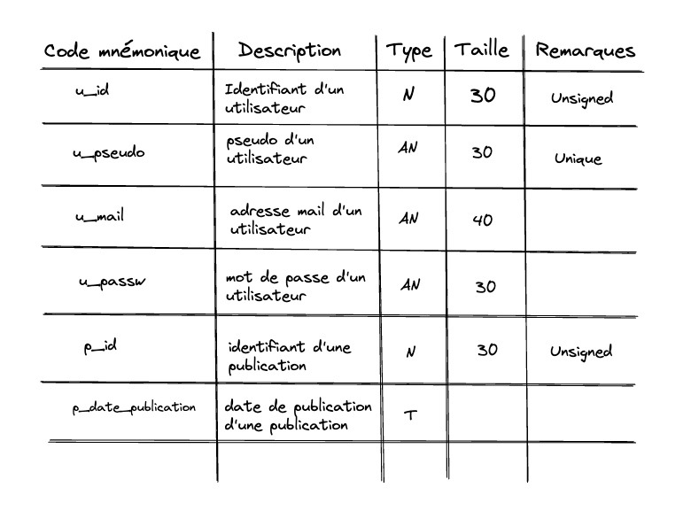
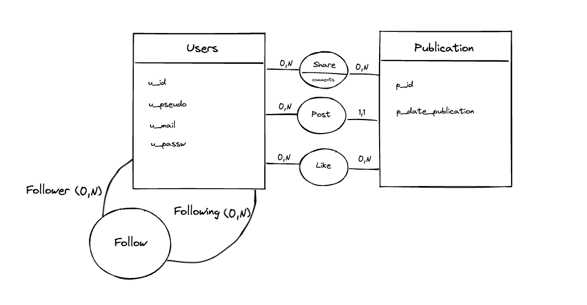

# Twitter like
## Base de données
### MCD
**Règles de gestion** 
- Un utilisateur doit avoir un pseudo, un email et un mot de passe 
- Un utilisateur peut publier zéro ou plusieurs publications
- Un utilisateur peut suivre zéro ou plusieurs utilisateurs
- Un utilisateur peut partager zéro ou plusieurs publications
- Un utilisateur peut liker zéro ou plusieurs publications

- Une publication a une date de publication
- Une publication a un identifiant 
- Une publication peut être publier par un et un seul utilisateur
- Une publication peut être liker par zéro ou plusieurs utilisateurs
- Une publication peut être partager par zéro ou plusieurs utilisateurs 

**Dictionnaire de données**

**Dépendances fonctionnelles**
- <ins>user_id</ins> ? user_pseudo, user_mail, user_mdp
- <ins>pub_id</ins> ? pub_date_publication

**Schéma MCD**

### MLD
- Utilisateur (<ins>u_id</ins>, u_pseudo, u_mail, u_mdp)
- Publication (<ins>p_id</ins>, p_date_publication, #u_id)
- Share (<ins>u_id</ins>, <ins>p_id</ins>, commentaire)
- Like (<ins>u_id</ins>, <ins>p_id</ins>)
- Follow (<ins>u_id</ins>, <ins>f_id</ins>)
