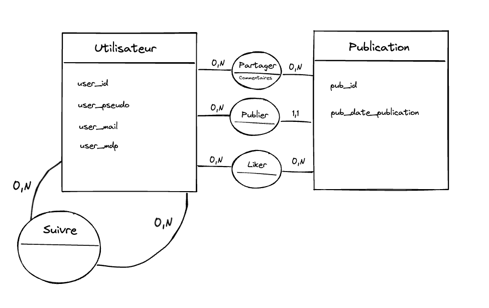

# Twitter like

- Utilisateurs
- Publication
- (Likes sur publication)
- Follow
- Espace profil où je peut voir le nombre de followers et le total des likes sur toutes nos publications et upload de pdp

## Base de données
### MCD
**Règles de gestion** 
- Un utilisateur doit avoir un pseudo, un email et un mot de passe 
- Un utilisateur peut publier zéro ou plusieurs publications
- Un utilisateur peut suivre zéro ou plusieurs utilisateurs
- Un utilisateur peut partager zéro ou plusieurs publications
- Un utilisateur peut liker zéro ou plusieurs publications

- Une publication a une date de publication
- Une publication a un identifiant 
- Une publication peut être publier par un et un seul utilisateur
- Une publication peut être liker par zéro ou plusieurs utilisateurs
- Une publication peut être partager par zéro ou plusieurs utilisateurs 

**Dictionnaire de données**

**Dépendances fonctionnelles**
- user_id ? user_pseudo, user_mail, user_mdp
- pub_id ? pub_date_publication

**Schéma MCD**

### MLD
- Utilisateur (user_id, user_pseudo, user_mail,user_mdp)
- Publication (pub_id,pub_date_publication)
