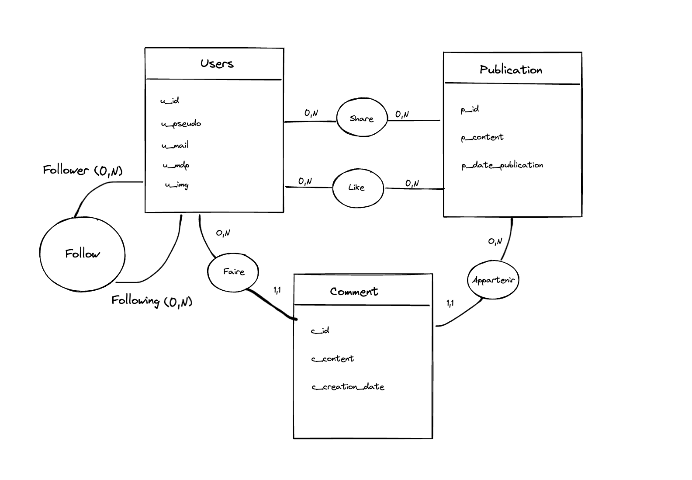

# Twitter like
## Base de données
### MCD
**Règles de gestion** 
- Un utilisateur doit avoir un identifiant, un pseudo, un email et un mot de passe 
- Un utilisateur peut avoir une photo de profil
- Un utilisateur peut publier zéro ou plusieurs publications
- Un utilisateur peut partager zéro ou plusieurs publications

- Une publication a une date de publication
- Une publication a un identifiant 
- Une publication peut être publier par un et un seul utilisateur
- Une publication peut être partager par zéro ou plusieurs utilisateurs 

**Dictionnaire de données**

**Dépendances fonctionnelles**
- <ins>user_id</ins> ? user_pseudo, user_mail, user_mdp, user_img
- <ins>publication_id</ins> ? publication_content, publication_date_publication
<ins>comment_id</ins> ? comment_content, comment_creation_date

**Schéma MCD**

### MLD
- Utilisateur (<ins>u_id</ins>, u_pseudo, u_mail, u_mdp)
- Publication (<ins>p_id</ins>,publication_content  ,publication_date_publication, #u_id)
- Share (<ins>user_id</ins>, <ins>publication_id</ins>, share_sharing_date)
- Comment (<ins>comment_id</ins>, comment_content, comment_creation_date, #user_id, #publication_id)

### MPD

